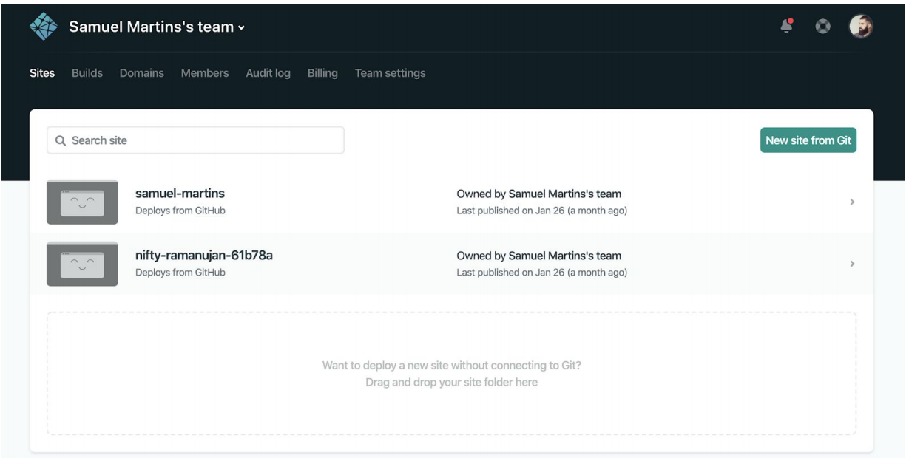
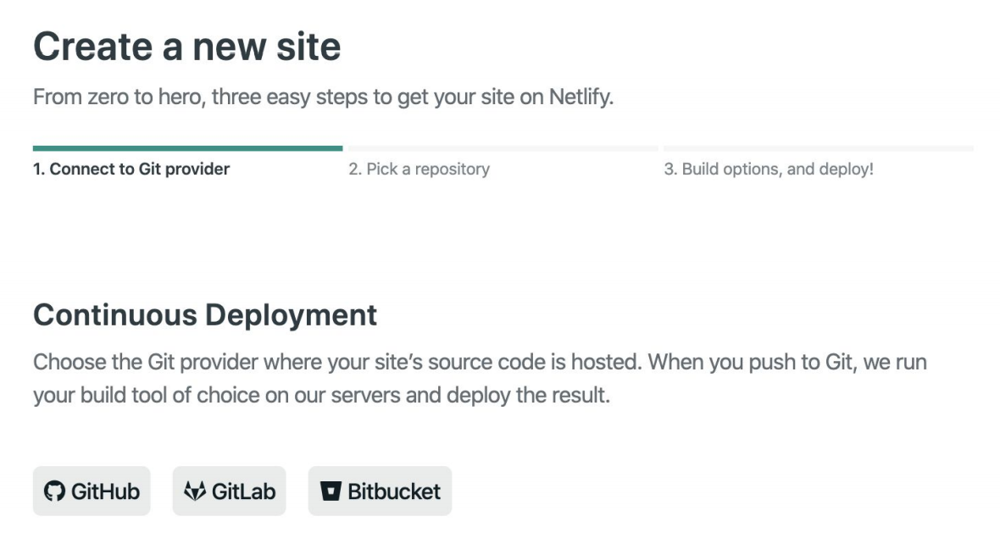
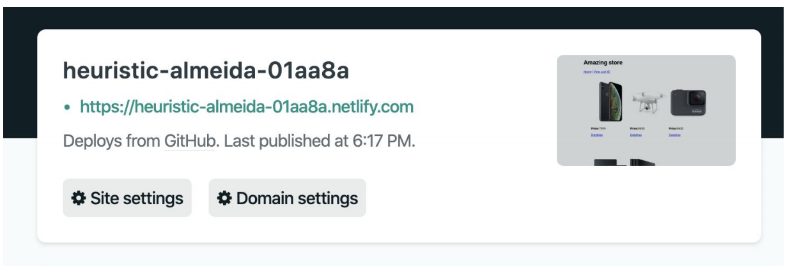

# Exercício 06
## Passo 1
Neste exercício, iremos fazer utilizar a arquitetura de Presentational and Container components, podendo (ou não) ser combinada com o conceito de hooks no React. Para isso, utilize como base o Exercício 03 ou Exercício 04 e com os conhecimentos adquiridos sobre a nova arquitetura, refatore os componentes de forma a seguir o padrão arquitetural Presentational and Container components proposto em sala de aula.

## Passo 2
Com a solução pronta, iremos fazer o deploy da nossa aplicação no Netlify. Essa plataforma é totalmente gratuita e permite a hospedagem de sites estáticos e funções serverless gratuitamente. Para isso, crie uma conta clicando em Sign up, no canto direito superior da tela.

## Passo 3
Coloque a solução desenvolvida no github. Em seguida, clique em “New site from git”, dentro da plataforma Netlify.

## Passo 4
Selecione como provedor de Git o Github.

## Passo 5
Conceda a autorização necessária ao netlify para listagem dos repositórios. Em seguida, selecione o repositório criado e na tela seguinte, clique em “Deploy site”.

## Passo 6
Após alguns minutos, você deverá ver uma imagem semelhante a imagem abaixo. Após o deploy da nossa solução, clique em Site settings > Change site name. Coloque o seu nome + sobrenome como domínio.

## Importante
Na entrega do exercício, coloque um arquivo com o nome “link.txt” contendo o link do projeto hospedado.

# Para executar

`npm start`
Runs the app in the development mode. 
Open [http://localhost:3000](http://localhost:3000) to view it in the browser.

https://diogoperdigao.netlify.com/

## Autor
Diogo Passos Perdigão Britto